# go-errforge

[](https://github.com/grandper/go-errforge/actions/workflows/go-test.yml)
[](https://github.com/grandper/go-errforge/actions/workflows/go-lint.yml)
[](https://pkg.go.dev/github.com/grandper/go-errforge/errforge)
[](LICENSE)

`go-errforge` makes errors a first-class part of your program instead of an
afterthought. It is a **drop-in replacement** for the standard library `errors`
package and `fmt.Errorf`: every value it produces is still a plain `error` that
obeys the Go 1.13 conventions — `errforge.Is`, `errforge.As`, `errforge.Unwrap` all
work exactly as before, on standard and third-party errors alike — while gaining
a handful of features that make errors easier to build, inspect, and present.

## The name

**errforge** reads as **err + forge**. A forge is where raw metal is heated and
hammered into a finished, purpose-built tool — and that is precisely what this
library does with a bare error.

The standard library hands you the raw iron: a value with a message and nothing
else. `errforge` is the workshop where you work it into the error your program
actually needs. You start from a plain value and *shape* it, adding only what the
situation calls for:

- **Wrap and weld.** Join one or many causes into a single error while keeping
  every reference reachable (`Wrap`, `Link`, `Append`, `Join`).
- **Stamp it.** Attach a transport-neutral `Code` and the source `Location` where
  the failure was struck, so it can be read back anywhere up the stack.
- **Temper it.** Capture a stack trace, or mark an error as transient
  (`ToTransient`) without changing its message or identity.
- **Finish it for its audience.** Give it a `PublicError` for the user and map it
  onto the right HTTP or gRPC response at the boundary.

Nothing is forced on you: like a forge, you heat and hammer only the piece in
front of you. Every finished error is still a plain `error` that plays by the
standard rules, so the whole toolkit interoperates freely with the standard
library and third-party code.

The Go module is `github.com/grandper/go-errforge` (the `go-` prefix matches the
sibling `go-` libraries), while the package you import and call is `errforge`:
`errforge.New`, `errforge.Wrap`, `errforge.WithCode`.

**Main features:**

- **Simple messages and sentinels** — create plain errors and sentinel values
  with `New` and `Newf`, and enrich a sentinel at the call site with `WithErr`,
  `WithDetail` and `WithDetailf`.
- **Flexible wrapping** — wrap one *or many* errors while preserving every
  reference: `Wrap`, `Wrapf`, `Link`.
- **Multierrors** — collect independent errors into a single value: `Append`,
  `Join`, and the `MultiError` interface.
- **Field errors** — tie a validation failure to the input it is about, so the
  boundary reports every bad field of a request at once: `FieldError`,
  `GetFieldErrors`, and the `fields` list of `WriteErrorJSON`.
- **Rich inspection** — everything the standard library offers, plus `RootCause`
  and `IsAny` for matching against several sentinels at once.
- **Stack traces** — attach and retrieve stack traces without changing an
  error's identity: `WithStack`, `GetStackTrace`, `CreateStackFrame`.
- **Error codes & propagation** — stamp an error with a transport-neutral
  `Code` (the `google.rpc.Code` vocabulary: `NotFound`, `InvalidArgument`, …)
  and propagate it while capturing *where* it happened: `Detailed`,
  `NewWithCode`, `Propagate`, `PropagateWithCode`, `GetCode`, `GetLocation`,
  `GetDetails`.
- **Code mapper** — attach the right code to sentinels you do not own
  (`sql.ErrNoRows`, `redis.Nil`, `io.EOF`) from one table at the adapter edge:
  `NewMapper`, `Map(code).To(errs...)`, `Mapper.AttachCodeTo`.
- **Classification marker** — tag an error with out-of-band knowledge that
  travels with it: `ToTransient` / `IsTransient` answers *should I retry?*.
- **User-facing errors** — `PublicError` helps you write messages that tell the
  user what happened, why, and what to do next, and makes them translatable
  with a `Key` and raw `Params` the client formats in the user's language.
- **Transport mapping** — turn a coded error into the right response at the
  boundary, with no mapping table to write: `WriteError` / `WriteErrorJSON`
  (HTTP), `GRPCStatus` (gRPC), `Code.HTTP`, `Code.GRPC`, `CodeFromHTTP`,
  `CodeFromGRPC`. Context errors map too: `ctx.Err()` answers `504` or `499`.
- **Panic handling** — turn recovered panics into errors that carry a stack
  trace: `Recover`, `FromRecover`, `FromPanic`.
- **Pretty printing** — render an error together with its stack traces and
  nested errors: `Print`, `Sprint`, `Fprint`.
- **Structured logging** — log any error's whole tree — message, code, flags,
  location, stack, causes — with `Attr` (`slog`), `ZapField` ([zap][zap]) and
  `LogObject` ([zerolog][zerolog]), whatever wrapper is on top.
- **Control-flow helpers** — `Handle`, `Filter`, `RootCause`, `FromContext`.
- **Linter** — two `go vet`-compatible analyzers that report the standard
  `errors` package and `fmt.Errorf`, and rewrite them to the equivalent
  `errforge` call with `-fix`.
- **Claude Code skill** — a plugin that teaches an AI assistant the decision
  tree and the checklist of this README, so generated code uses the same
  functions for the same reasons you would.

## Installation

```bash
go get github.com/grandper/go-errforge
```

```go
import "github.com/grandper/go-errforge/errforge"
```

You call it as `errforge`. Because every error it produces respects the Go 1.13
error conventions, adopting it is a drop-in replacement for `fmt.Errorf` and the
standard `errors` helpers — swap those calls for `errforge` ones and nothing else
in your code has to change until you want to reach for the new features. The
package is named `errforge`, not `errors`, so it never shadows the standard
library: a codebase can migrate one file at a time, with both imports side by
side and no alias. The [linter](#linter) shipped with the module points at the
calls still left to convert.

## Design principles

Before diving into the API, it helps to understand the ideas the package is built
around. They are what tell the different features apart, and they explain why some
of the functions behave the way they do.

1. **Full compatibility first.** Every value returned by this package is a plain
   `error` that plays by the standard rules. `errforge.Is`, `errforge.As` and
   `errforge.Unwrap` from this package delegate to the standard library, so you can
   mix and match with third-party code freely.
2. **The message is not the chain.** Unlike `fmt.Errorf("...: %w", err)`, wrapping
   an error here does **not** splice the cause into the message. `Wrap` keeps the
   two apart so you decide exactly what each layer says, while the cause remains
   reachable for `Is`/`As`/`Unwrap`. When you *do* want both messages rendered,
   `Link` (or a sentinel's `WithErr`) is there for that.
3. **Errors carry context, not just text.** An error can hold a machine-readable
   code, the source location where it was created, a captured stack trace, a
   classification marker, and a separate user-facing explanation. You attach only
   what you need, when you need it.
4. **Two audiences, two messages.** Operators want short, repeatable, technical
   errors they can log and grep. Users want a friendly explanation of what to do
   next. `PublicError` lets a single error serve both without compromise.

## Which feature should I use?

Not sure which function fits your situation? Start on the left with what you are
trying to do and follow the branches; each leaf names the function(s) to reach
for, all of which are described in detail under [Usage](#usage).

```mermaid
flowchart LR
    start(["I am dealing with an error"]) --> q{"What do you<br/>need to do?"}

    q -->|"Create a new error"| create{"Does it need a<br/>Code (NotFound, ...)?"}
    create -->|"No: fixed message<br/>or sentinel"| fNew["New"]
    create -->|"No: formatted message<br/>(fmt.Errorf replacement)"| fNewf["Newf"]
    create -->|"Yes"| fNewWithCode["NewWithCode"]
    create -->|"Yes, plus a cause or<br/>a user-facing message"| fDetailed["Detailed with WithCode /<br/>WithCause / WithPublic"]

    q -->|"Add context to an<br/>error I received"| ctx{"What should<br/>the result say?"}
    ctx -->|"My sentinel,<br/>plus the specifics"| fSentinel["sentinel.WithDetail /<br/>WithDetailf / WithErr"]
    ctx -->|"Only my new message<br/>(cause stays reachable)"| fWrap["Wrap / Wrapf"]
    ctx -->|"Both messages,<br/>rendered inline"| fLink["Link"]
    ctx -->|"My message + where it<br/>happened, keeping the code"| fPropagate["Propagate"]
    ctx -->|"Same, but set or<br/>override the code"| fPropagateCode["PropagateWithCode"]

    q -->|"Combine several<br/>independent errors"| multi{"How do they<br/>arrive?"}
    multi -->|"One at a time<br/>(e.g. in a loop)"| fAppend["Append"]
    multi -->|"All at once"| fJoin["Join"]

    q -->|"Attach knowledge without<br/>changing message or identity"| tag{"What do you<br/>know about it?"}
    tag -->|"Where it came from"| fWithStack["WithStack"]
    tag -->|"It is worth retrying"| fTransient["ToTransient"]
    tag -->|"What the end user<br/>should be told"| fPublic["PublicError<br/>(attach via WithPublic)"]
    tag -->|"Which input of the<br/>request it is about"| fFieldError["FieldError"]
    tag -->|"Which Code a sentinel<br/>I do not own maps to"| fMapper["Mapper.AttachCodeTo<br/>(NewMapper + Map(code).To)"]

    q -->|"Inspect an error"| inspect{"What do you<br/>want to know?"}
    inspect -->|"Does it match<br/>a sentinel?"| fIs["Is"]
    inspect -->|"Does it match any of<br/>several sentinels?"| fIsAny["IsAny"]
    inspect -->|"Is a concrete type<br/>in the chain?"| fAs["As"]
    inspect -->|"What started it all?"| fRootCause["RootCause"]
    inspect -->|"Which members does<br/>a multierror hold?"| fUnwrapErrors["UnwrapErrors /<br/>MultiError.Errors"]
    inspect -->|"Code, location or<br/>user-facing details?"| fGetters["GetCode / GetLocation /<br/>GetDetails"]
    inspect -->|"Which inputs failed<br/>validation?"| fGetFieldErrors["GetFieldErrors"]
    inspect -->|"Where was it raised?"| fGetStack["GetStackTrace"]
    inspect -->|"Should I retry?"| fIsTransient["IsTransient"]

    q -->|"Present it at<br/>a boundary"| present{"Who receives it?"}
    present -->|"HTTP client,<br/>plain-text body"| fWriteError["WriteError<br/>(Code.HTTP)"]
    present -->|"HTTP client,<br/>JSON body"| fWriteErrorJSON["WriteErrorJSON<br/>(Code.HTTP)"]
    present -->|"gRPC client"| fGRPC["GRPCStatus<br/>(Code.GRPC)"]
    present -->|"Structured logs"| fLog["Attr / ZapField /<br/>LogObject"]
    present -->|"A human debugging"| fPrint["Print / Sprint / Fprint"]
    present -->|"The shell<br/>(process exit code)"| fExit["DetailedError.ExitCode"]

    q -->|"Turn a panic<br/>into an error"| panic{"How do you<br/>catch it?"}
    panic -->|"Deferred callback"| fRecover["Recover"]
    panic -->|"I already called<br/>recover() myself"| fFromRecover["FromRecover"]
    panic -->|"Guard a single<br/>function call"| fFromPanic["FromPanic"]

    q -->|"Shorten common<br/>control flow"| flow{"Which pattern?"}
    flow -->|"Failure is fatal:<br/>value or panic"| fHandle["Handle"]
    flow -->|"Deliberately ignore<br/>the error"| fFilter["Filter"]
    flow -->|"Bail out when the<br/>context is done"| fFromContext["FromContext"]
```



## Usage

Every error produced by this package works with `errforge.Is`, `errforge.As` and
`errforge.Unwrap`, and integrates with the standard structured loggers. The sections
below walk through each feature in turn, building up from creating errors to
inspecting, enriching, and finally presenting them.

### Simple errors and sentinels

The most basic building block is `New`, which returns an error with the message
you give it:

```go
err := errforge.New("an error occurred")
// err.Error() == "an error occurred"
```

Each call to `New` returns a **distinct** value, even when the message is
identical, so two errors built from the same string are never accidentally equal.
That property is what makes sentinel errors reliable. Assign an error to a
package-level variable and match against it with `errforge.Is`:

```go
var ErrNotFound = errforge.New("not found")

// ...
if errforge.Is(err, ErrNotFound) {
    // handle the missing resource
}
```

`Newf` formats a message and supports the `%w` verb, exactly like `fmt.Errorf`. It
is the direct replacement for `fmt.Errorf`, so wrapping-by-formatting keeps
working when you want it:

```go
cause := errforge.New("connection refused")
err := errforge.Newf("dialing database: %w", cause)
// err.Error() == "dialing database: connection refused"
// errforge.Is(err, cause) == true
```

### Enriching a sentinel

A sentinel is perfect for *identity*, but at the point a failure actually happens
you usually know more than the sentinel says — *which* record was missing, *what*
the driver returned. `New` returns a concrete `*errforge.Error` whose builders let
you add that context **without losing the sentinel's identity**: the result still
matches the original sentinel under `errforge.Is`, and the sentinel value itself is
never modified.

`WithDetail` appends a detail to the message; `WithDetailf` is its formatted
variant:

```go
var ErrNotFound = errforge.New("not found")

err := ErrNotFound.WithDetailf("user with id %d", 42)
// err.Error() == "not found: user with id 42"
// errforge.Is(err, ErrNotFound) == true
```

`WithErr` attaches an underlying cause, rendering both messages and keeping *both*
the sentinel and the cause reachable. It returns the receiver unchanged when the
cause is nil, so it can be applied inline:

```go
cause := errforge.New("connection refused")
err := ErrNotFound.WithErr(cause)
// err.Error() == "not found: connection refused"
// errforge.Is(err, ErrNotFound) == true
// errforge.Is(err, cause) == true
```

The builders chain, so a single expression can add both a detail and a cause:

```go
err := ErrNotFound.WithDetailf("user with id %d", 42).WithErr(dbErr)
// err.Error() == "not found: user with id 42: <dbErr message>"
```

### Wrapping errors

`Wrap` adds a message on top of an existing error. This is where `go-errforge`
deliberately differs from `fmt.Errorf`: the `Error()` string is **only** the
wrapping message. The cause is preserved for `Is`/`As`/`Unwrap`, but it is *not*
concatenated into the text — you stay in full control of what each layer reports:

```go
cause := errforge.New("permission denied")
err := errforge.Wrap("unable to open resource", cause)
// err.Error() == "unable to open resource"
// errforge.Is(err, cause) == true
// errforge.Unwrap(err).Error() == "permission denied"
```

`Wrap` can wrap **several** errors at once. Nil errors are dropped, and if every
error passed in is nil the result is nil — so you can wrap opportunistically
without guarding first:

```go
err := errforge.Wrap("invalid user", errEmptyName, errBadEmail)
// err.Error() == "invalid user"
// errforge.Is(err, errEmptyName) == true
// errforge.Is(err, errBadEmail) == true
```

`Wrapf` formats the wrapping message. The variadic argument holds, in order, first
the values for the format verbs, then the error(s) to wrap. The number of leading
values is inferred by counting the verbs in the format string, so trailing
arguments are treated as errors (nil and non-error values are ignored):

```go
err := errforge.Wrapf("reading %s", "config.yaml", cause)
// err.Error() == "reading config.yaml"
// errforge.Is(err, cause) == true
```

### Linking errors

`Link` is similar to `Wrap`, but it renders **both** messages in `Error()`. Reach
for it when the cause adds information the reader should see inline:

```go
err := errforge.Link(errRequest, errTimeout)
// err.Error() == "request failed: timeout"
// errforge.Is(err, errRequest) == true
// errforge.Is(err, errTimeout) == true
```

`Link` also accepts several causes, in which case they are rendered as a
bracketed list. If either side is nil, the other is returned unchanged; if
everything is nil, `Link` returns nil:

```go
err := errforge.Link(errRequest, errTimeout, errReset)
// err.Error() == "request failed: [timeout,reset]"
```

### Multierrors

Multierrors treat a set of errors as a single value — handy for validation, where
you want to report *every* problem at once rather than stopping at the first.

`Append` builds one up incrementally. Nil errors are ignored, and a lone non-nil
error is returned as-is rather than being wrapped, so the common case stays
cheap:

```go
var err error
err = errforge.Append(err, errforge.New("username cannot be empty"))
err = errforge.Append(err, errforge.New("password is too short"))
// err.Error() == "errors occurred: [username cannot be empty, password is too short]"
```

`Join` combines a fixed set of errors in one call, discarding nil values and
returning nil when they are all nil:

```go
err := errforge.Join(
    errforge.New("disk full"),
    nil, // discarded
    errforge.New("quota exceeded"),
)
// err.Error() == "errors occurred: [disk full, quota exceeded]"
```

Both satisfy the `MultiError` interface, which exposes the underlying errors:

```go
type MultiError interface {
    error
    Errors() []error
}

if me, ok := err.(errforge.MultiError); ok {
    for _, e := range me.Errors() {
        fmt.Println(e) // "disk full", then "quota exceeded"
    }
}
```

The members can also be retrieved with `errforge.UnwrapErrors(err)`, and the whole
value supports `errforge.Is` / `errforge.As` across **all** of its members — a match
against any one of them succeeds.

### Field errors

A multierror says *what* went wrong with a request; a form also needs to know
*which input* each failure is about, so it can underline the right box.
`FieldError` ties an error to the name of the input. It is a marker like
`ToTransient`: the message and identity are untouched, the result unwraps to
the original and still matches it under `Is`, and nil in gives nil out. Build
each failure from a sentinel, so the server can tell them apart too:

```go
var (
    ErrRequired  = errforge.New("cannot be empty")
    ErrBadFormat = errforge.New("has a bad format")
)

func validate(in CreateUser) error {
    var err error
    if in.Name == "" {
        err = errforge.Append(err, errforge.FieldError("name", ErrRequired))
    }
    if !emailRx.MatchString(in.Email) {
        err = errforge.Append(err, errforge.FieldError("email", ErrBadFormat.WithDetail(in.Email)))
    }
    return errforge.PropagateWithCode(err, errforge.InvalidArgument, "invalid user")
}
```

`GetFieldErrors` collects every field in the tree, in the order they were
added, as `FieldViolation{Field, Err}` values — `Err` is the wrapped error
with the marker removed, so it still answers `Is`:

```go
for _, v := range errforge.GetFieldErrors(err) {
    fmt.Println(v.Field, errforge.Is(v.Err, ErrRequired)) // "name true", then "email false"
}
```

Two rules keep a field's information with the field:

- **A field's `Code` and `PublicError` belong to the field.** `GetCode` and
  `GetDetails` do not look inside a `FieldError`, so a translatable message
  attached to one input never becomes the message of the whole response. The
  request as a whole is described by the error the fields are collected under
  — the `PropagateWithCode` above.
- **Nested fields are joined with a dot.** `FieldError("address",
  FieldError("city", ErrRequired))` is reported once, as `"address.city"`.

At the HTTP boundary, `WriteErrorJSON` lists the fields in the body (see
[Mapping errors to a transport](#mapping-errors-to-a-transport)); a gRPC
handler can map the same list onto `errdetails.BadRequest_FieldViolation` in
one loop.

### Inspecting error chains

The standard inspection functions are re-exported so you never have to import two
`errors` packages side by side:

- `errforge.Is(err, target)` — reports whether any error in `err`'s tree matches
  `target`.
- `errforge.As(err, target)` — finds the first error in the tree assignable to
  `target`.
- `errforge.Unwrap(err)` — returns the single wrapped error, if any.
- `errforge.UnwrapErrors(err)` — returns the members of a multierror
  (`Unwrap() []error`), if any.

`IsAny` is the variadic companion to `Is`: it reports whether `err` matches **any**
of a set of sentinels, running the full Go 1.13 tree walk for each target. It
collapses a group of sentinels that mean the same thing into one clean branch:

```go
switch {
// All validation failures collapse to one branch.
case errforge.IsAny(err, ErrIDEmpty, ErrIDBadFormat, ErrNameTooLong, ErrForbiddenChars):
    return errforge.InvalidArgument
case errforge.Is(err, ErrNotFound):
    return errforge.NotFound
default:
    return errforge.Internal
}
```

On top of those, `RootCause` walks the chain all the way down and returns the
original error at the bottom:

```go
cause := errforge.New("permission denied")
err := errforge.Wrap("unable to open resource", cause)

root := errforge.RootCause(err)
// root.Error() == "permission denied"
```

### Stack traces

`WithStack` attaches a stack trace to an error **without** changing its message or
identity: the result reports the same `Error()` string, unwraps to the original,
and still matches it under `errforge.Is`/`As`. `GetStackTrace` retrieves the first
trace found while walking the tree depth-first (through both `Unwrap() error` and
`Unwrap() []error`, and both sides of a `Link`), so the outermost one wins:

```go
err := errforge.WithStack(errforge.New("boom"))
// err.Error() == "boom"  (message and identity are unchanged)

for _, frame := range errforge.GetStackTrace(err) {
    fmt.Println(frame.String()) // "path/file.go:line"
}
```

A `StackTrace` is simply a slice of `*StackFrame`, ordered from the innermost
frame (where the trace was captured) outward. Any error that carries one
implements the `StackTracer` interface, so you can detect and handle it
specially:

```go
type StackTracer interface {
    error
    StackTrace() StackTrace
}

if st, ok := err.(errforge.StackTracer); ok {
    trace := st.StackTrace()
    _ = trace
}
```

The `StackTrace` type implements `fmt.Formatter`. `%s` and `%v` print one frame
per line as `\tat <function> (<file>:<line>)`, and the `+` flag qualifies each
function with its package:

```go
fmt.Printf("%+v", errforge.GetStackTrace(err))
//	at errforge.mightFail (file.go:42)
//	...
```

An individual `StackFrame` records the import path, package, function, file and
line, and its own `Format` method exposes fine-grained verbs so you can render
exactly the part you want:

| Verb | Renders                                            |
|------|----------------------------------------------------|
| `%h` | path (import path of the directory)                |
| `%p` | package name                                       |
| `%f` | file name                                          |
| `%n` | function name (`%+n` adds the package)             |
| `%d` | line number                                         |
| `%s` | file name (`%+s` adds the function on its own line)|
| `%v` | same as `%s` (`%+v` is `%+s:%d`)                    |

```go
frame := errforge.GetStackTrace(err)[0]
fmt.Printf("%f:%d\n", frame, frame) // "file.go:42"
fmt.Printf("%+n\n", frame)          // "errforge.mightFail"
```

Because `Format` takes precedence over `String` in the `fmt` functions, a bare
`fmt.Println(frame)` prints the `%v` form — the file name alone. Call
`frame.String()` for the full `path/file.go:line` description. `StackFrame` also
implements `encoding.TextMarshaler`, so it serializes cleanly in text-oriented
output.

When you want the location of the *current* call rather than a whole trace,
`CreateStackFrame` returns the single frame of its caller:

```go
frame := errforge.CreateStackFrame()
fmt.Println(frame.String()) // "path/file.go:line"
```

### Error codes

A `Code` is the **category** of an error, independent of the transport that will
report it. The set is fixed and mirrors [`google.rpc.Code`][rpccode] — the
vocabulary gRPC uses, and the one HTTP statuses map onto:

| Code                 | Meaning                                              | HTTP | gRPC                 |
|----------------------|------------------------------------------------------|------|----------------------|
| `InvalidArgument`    | the caller sent an invalid argument                  | 400  | `InvalidArgument`    |
| `Unauthenticated`    | no valid credentials                                 | 401  | `Unauthenticated`    |
| `PermissionDenied`   | the caller is not allowed to do this                 | 403  | `PermissionDenied`   |
| `NotFound`           | the requested entity does not exist                  | 404  | `NotFound`           |
| `AlreadyExists`      | the entity to create already exists                  | 409  | `AlreadyExists`      |
| `Aborted`            | aborted by a concurrency conflict                    | 409  | `Aborted`            |
| `FailedPrecondition` | the system is not in the required state              | 412  | `FailedPrecondition` |
| `ResourceExhausted`  | a quota or a resource ran out                        | 429  | `ResourceExhausted`  |
| `Canceled`           | the caller canceled the request                      | 499  | `Canceled`           |
| `Internal`           | an internal invariant was broken                     | 500  | `Internal`           |
| `Unimplemented`      | not implemented or not supported                     | 501  | `Unimplemented`      |
| `Unavailable`        | the service is temporarily unavailable               | 503  | `Unavailable`        |
| `DeadlineExceeded`   | the deadline expired before completion               | 504  | `DeadlineExceeded`   |
| `Unknown`, `DataLoss`, `OutOfRange`, `OK` | as in `google.rpc.Code`         | 500, 500, 400, 200 | same |

Why a fixed set? Because the domain knows *what* went wrong — "the track was not
found" — and the boundary knows *how to say it* — `404` or `codes.NotFound`.
That translation is the same in every service, so the library ships it once
(`Code.HTTP()`, `Code.GRPC()`, and the reverse `CodeFromHTTP`, `CodeFromGRPC`)
and no application ever writes a mapping table. What is specific to your
application goes in the message and in the `PublicError`, not in the code.

Create a coded error directly with `NewWithCode` (the message follows the usual
formatting rules), and read the code back with `GetCode`:

```go
err := errforge.NewWithCode(errforge.DeadlineExceeded, "request timed out")
// err.Error() == "request timed out"
// errforge.GetCode(err) == errforge.DeadlineExceeded
// errforge.GetCode(err).HTTP() == 504
```

`GetCode` reports the code of the first error in the tree that carries one —
walking through wrappers, markers and multierrors — or `NoCode`, the zero value,
when nothing does. Two kinds of foreign errors are coded errors in disguise and
report a code as well: an error received from a gRPC client (one carrying a
`*status.Status`), and a context error — `context.DeadlineExceeded` reports
`DeadlineExceeded` and `context.Canceled` reports `Canceled`, so `ctx.Err()`
returned as is (or propagated) never degrades to a `500`:

```go
err := errforge.Propagate(ctx.Err(), "loading track") // ctx was canceled
// errforge.GetCode(err) == errforge.Canceled
// errforge.GetCode(err).HTTP() == 499
```

A code set explicitly with `PropagateWithCode` still wins over both:

```go
switch errforge.GetCode(err) {
case errforge.DeadlineExceeded, errforge.Unavailable:
    // retry
case errforge.NoCode:
    // no code was attached anywhere in the tree
}
```

Every code also has a `String()` — its `google.rpc.Code` name, such as
`NOT_FOUND`, which is what the structured loggers emit — and a `Text()`, a
one-sentence description.

### Mapping foreign sentinels to codes

`NewWithCode` and `PropagateWithCode` stamp a code where the error is created.
That is not always possible: a dependency returns *its* sentinels —
`sql.ErrNoRows`, `redis.Nil`, `io.EOF`, `syscall.ECONNREFUSED` — and without a
code every one of them reaches the boundary as a `500`. Rather than an
`errors.Is` branch per sentinel in every handler, a `Mapper` holds that
knowledge once, at the adapter edge:

```go
var codeOf = errforge.NewMapper(
    errforge.Map(errforge.NotFound).To(sql.ErrNoRows, redis.Nil),
    errforge.Map(errforge.Unavailable).To(io.ErrUnexpectedEOF, syscall.ECONNREFUSED),
    errforge.Map(errforge.AlreadyExists).To(ErrDuplicateKey),
)
```

`Map(code).To(errs...)` registers each sentinel under a code; registering one
twice keeps the last code. Matching uses `Is`, so a sentinel wrapped by the
dependency (or by you) still resolves. `context.Canceled` and
`context.DeadlineExceeded` are registered by default, to `Canceled` and
`DeadlineExceeded`.

`AttachCodeTo` returns the error carrying the code it maps to. Like
`ToTransient`, it changes nothing about the error itself — same `Error()`
string, unwraps to the original, `Is`/`As` see through it — and returns nil for
nil, so it fits inline:

```go
func (r *Repo) Load(ctx context.Context, id string) (*Track, error) {
    row, err := r.db.Get(ctx, id)
    if err != nil {
        return nil, errforge.Propagate(codeOf.AttachCodeTo(err), "loading track %s", id)
    }
    return row.toTrack(), nil
}

// sql.ErrNoRows          → GetCode == NotFound      → WriteError answers 404
// syscall.ECONNREFUSED   → GetCode == Unavailable   → IsTransient is true
// an unregistered error  → GetCode == Internal      → WriteError answers 500
```

Three rules decide the code:

1. **A code already in the chain wins.** An error built with `NewWithCode`, a
   gRPC status, or a context error is returned untouched — the origin knows
   better than the edge.
2. **Otherwise the registry answers**, walking the chain with `Is`.
3. **No match means `Internal`.** A sentinel the mapper does not know is a
   failure on our side, not a silent uncoded error.

`Mapper.Code(err)` exposes the lookup alone (`OK` for nil) when you want the
`Code` value without decorating the error — for instance to pass it to
`PropagateWithCode` when the message must override an existing code.

### Detailed errors and propagation

A `DetailedError` is the workhorse behind codes and propagation. It bundles a
code, the **source location** where it was created, an optional cause, and an
optional user-facing `PublicError`. Build one directly with `Detailed` and its
options:

```go
err := errforge.Detailed("query failed",
    errforge.WithCode(errforge.DeadlineExceeded),
    errforge.WithCause(cause),
    errforge.WithPublic(&errforge.PublicError{Message: "please try again later"}),
)
// err.Error() == "query failed"
```

More often, though, you will create detailed errors implicitly while propagating.
`Propagate` wraps an error with a message *and* the location of the call,
preserving the underlying code. Crucially, it returns nil when the cause is nil,
so you can skip the usual `if err != nil` dance:

```go
func process(arg string) error {
    result, err := doWork(arg)
    // If err is nil this returns nil.
    return errforge.Propagate(err, "failed to process %s", arg)
    // otherwise (returned).Error() == "failed to process <arg>"
}
```

`PropagateWithCode` does the same but *sets or overrides* the code instead of
inheriting the cause's:

```go
return errforge.PropagateWithCode(err, errforge.Unavailable, "calling payment service")
// (returned).Error() == "calling payment service"
// errforge.GetCode(returned) == errforge.Unavailable
```

Everything you attached is readable afterward through a small family of getters,
each of which walks the whole tree for the first error that exposes the
corresponding method — so a `Wrap`, a `ToTransient` marker or a `WithStack` on
top never hides what was stamped below:

- `errforge.GetCode(err)` — the error code, or `NoCode`.
- `errforge.GetLocation(err)` — the `*StackFrame` where the error was created.
- `errforge.GetDetails(err)` — the attached `*PublicError`, or nil.

A `DetailedError` also knows how to turn itself into a **process exit code** via
`ExitCode()`: it returns `1` when the error carries no code, and the numeric value
of the code otherwise — convenient for a `main` that wants to exit with a
meaningful status:

```go
if err := run(); err != nil {
    var de *errforge.DetailedError
    if errforge.As(err, &de) {
        os.Exit(de.ExitCode())
    }
    os.Exit(1)
}
```

### User-facing errors

`PublicError` separates the technical error from the message shown to a user. Its
fields are inspired by the questions a good error message should answer — what
happened, is anything lost, why, how to fix it, and what to do if that fails:

```go
err := &errforge.PublicError{
    Message:     "unable to connect to your account",
    Reassurance: "your changes were saved",
    Reason:      "we could not connect your account due to a technical issue on our end",
    Resolution:  "please try connecting again",
    WayOut:      "if the issue keeps happening, contact Customer Care",
}

err.Error()   // "unable to connect to your account"
err.Details() // the full, user-friendly explanation
```

`Error()` returns just the short `Message`, which is what you surface as the
headline. `Details()` renders the populated fields into a single, sentence-cased
string — empty fields are simply skipped, so you fill in only the ones that apply:

```
Your changes were saved. We could not connect your account due to a technical
issue on our end. Please try connecting again. If the issue keeps happening,
contact Customer Care
```

#### Translatable messages

Five English sentences are fine for a single-language product, but a front-end
cannot compute *"8 is too high, the maximum is 5"* in the user's language when
the numbers are baked into prose, and it cannot translate at all when there is
no key. `Key` and `Params` fix both: the key is a stable identifier the client
looks up in its own translation catalog, and `Params` carries the raw values
the message is computed from. `Message` becomes the fallback shown when no
translation exists:

```go
err := errforge.Detailed("quantity exceeds stock",
    errforge.WithCode(errforge.FailedPrecondition),
    errforge.WithPublic(&errforge.PublicError{
        Key:     "order.out_of_stock",        // the front-end's translation key
        Message: "not enough items in stock", // fallback when no translation exists
        Params:  errforge.Params{"requested": 8, "available": 5},
    }),
)

errforge.WriteErrorJSON(w, err)
// {"code":"FAILED_PRECONDITION","key":"order.out_of_stock",
//  "message":"not enough items in stock","params":{"available":5,"requested":8}}
```

Translation and formatting happen where the locale is known — the client —
instead of being frozen in Go string literals. `Params` is a
`map[string]any` whose values must be JSON-encodable; every one of them reaches
the client, so put in it only what a user may see. The internal data an
operator needs (entity IDs, table names) belongs in the logs, not here. Both
fields are optional: a `PublicError` without them behaves exactly as before,
and they are omitted from the JSON body and the logs when empty.

### Classification markers

A marker attaches a **fact** about an error — *it is worth retrying* — without
changing its message or identity, exactly like `WithStack` attaches a trace. The
result reports the same `Error()` string, unwraps to the original and still
matches it under `Is`/`As`; the fact is read back from anywhere in the chain by
the matching `Is*` function. There is one marker, and it answers one question:

| Question                | Marker        | Reader        | Codes that imply it by nature       |
|-------------------------|---------------|---------------|-------------------------------------|
| Should the caller retry? | `ToTransient` | `IsTransient` | `Unavailable`, `Aborted`, `DeadlineExceeded` |

Whose fault an error is — ours or the caller's — is not a marker: it is the
`Code`. A `NotFound`, an `InvalidArgument` or a `PermissionDenied` is the
caller's and answers a `4xx`; an `Internal`, a `DataLoss` or an `Unknown` is
ours and answers a `500`. And what the client is told is not a marker either: it
is the `PublicError` (see [User-facing errors](#user-facing-errors)). The two
cases call for two different reactions:

| The error is…      | Example                                   | What to do                                                                 |
|--------------------|-------------------------------------------|----------------------------------------------------------------------------|
| transient          | dropped connection, `503`, timeout        | retry with backoff, then give up                                            |
| not transient      | missing record, bad argument, broken invariant | answer the code's status, show the `PublicError` if one is attached and the message otherwise, do not retry |

#### Transient (retryable) errors

Some failures are worth retrying — a dropped connection, a timeout, a `503` from a
downstream service — while others are permanent. `ToTransient` marks an error as
retryable. It returns nil when the error is nil, so it can be applied inline:

```go
func (c *Client) fetch(ctx context.Context, id string) (*Record, error) {
    resp, err := c.do(ctx, id)
    if err != nil {
        // A network error is temporary — tag it and let the caller decide.
        return nil, errforge.ToTransient(errforge.Wrap("fetch record", err))
    }
    if resp.StatusCode == http.StatusServiceUnavailable {
        return nil, errforge.ToTransient(errforge.New("service unavailable"))
    }
    if resp.StatusCode == http.StatusNotFound {
        // A missing record is permanent — do NOT tag it.
        return nil, errforge.Newf("record %s not found", id)
    }
    return decode(resp)
}
```

`IsTransient` reads the marker back from **anywhere** in the chain, so retry logic
stays completely decoupled from where the classification was applied:

```go
func withRetry[T any](ctx context.Context, attempts int, op func() (T, error)) (T, error) {
    var err error
    var zero T
    for i := 0; i < attempts; i++ {
        var v T
        v, err = op()
        if err == nil {
            return v, nil
        }
        if !errforge.IsTransient(err) {
            return zero, err // permanent failure — stop immediately
        }
        time.Sleep(backoff(i))
    }
    return zero, errforge.Wrapf("giving up after %d attempts", attempts, err)
}
```

`withRetry` retries the "service unavailable" and network failures but returns the
"not found" error immediately — all without inspecting error types.

Some codes are transient by nature: `Unavailable`, `Aborted` and
`DeadlineExceeded` (`Code.Transient()`). `IsTransient` reports true for an error
carrying one of them even without an explicit marker, so
`NewWithCode(errforge.Unavailable, ...)` is retried as-is. The marker remains the
way to flag anything else — a network error with no code, or a `NotFound` that
you know will resolve.

#### Errors that are our fault

A failure on **our** side of the boundary — a broken invariant, an impossible
branch, a value that was guaranteed to be there and is not — is permanent, like
a `NotFound`, but it is not the caller's doing: it is a bug. There is no marker
for it; the `Internal` code says it, and `Code.HTTP()` turns it into a `500`.
When the technical sentence should not reach the client, attach a `PublicError`
in the same call:

```go
func (s *Service) Publish(ctx context.Context, id string) error {
    track, err := s.repo.Load(ctx, id)
    if err != nil {
        return err // NotFound stays the caller's problem, and its 404.
    }
    if track.Album == nil {
        // Every persisted track has an album; this state should be impossible.
        return errforge.Detailed("track "+id+" has no album",
            errforge.WithCode(errforge.Internal),
            errforge.WithPublic(&errforge.PublicError{Message: "this track cannot be published right now"}),
        )
    }
    return s.publisher.Publish(ctx, track)
}
```

The boundary then needs no special case: `WriteError` answers `500` with the
`PublicError` message, and the technical sentence, code and location go to the
log. `Internal`, `DataLoss` and `Unknown` are the codes `Code.HTTP()` maps to
`500` because of what they mean (`Code.Internal()`); `Code.Internal()` and
`Code.Transient()` are never both true for one code.

### Mapping errors to a transport

A code set deep in the domain layer is exactly what a transport boundary needs
to answer with the right status, and because the code set is fixed, the
translation is built in. Both helpers below read the code with `GetCode` and,
when present, the user-facing message with `GetDetails`. There is nothing to
configure.

The domain layer says what happened, in its own terms:

```go
func (r *Repo) Load(id string) (*Track, error) {
    row, err := r.db.Get(id)
    if errors.Is(err, sql.ErrNoRows) {
        return nil, errforge.PropagateWithCode(err, errforge.NotFound, "track %s", id)
    }
    // ...
}
```

For HTTP, `WriteError` writes the response in one line: the status is
`GetCode(err).HTTP()`, the body is the `PublicError` message when one is
attached, otherwise `err.Error()`. An error without a code answers `500`:

```go
func handleGetTrack(w http.ResponseWriter, r *http.Request) {
    t, err := repo.Load(r.PathValue("id"))
    if err != nil {
        errforge.WriteError(w, err) // 404 Not Found
        return
    }
    json.NewEncoder(w).Encode(t)
}
```

A `NotFound` created three layers deep, then `Propagate`d upward (the code is
preserved along the way), arrives at `handleGetTrack` and produces a clean `404` —
the handler never switches on error types and never consults a table. When the
sentinel belongs to a dependency and the `errors.Is` above would have to be
repeated for each one, a [`Mapper`](#mapping-foreign-sentinels-to-codes) attaches
the code from a single table instead.

`WriteErrorJSON` picks the status and the message exactly the same way but
writes them as a JSON `ErrorResponse`, so an API client reads the code **by
name** instead of inferring it from the status:

```go
errforge.WriteErrorJSON(w, err)
// HTTP/1.1 404 Not Found
// Content-Type: application/json
//
// {"code":"NOT_FOUND","message":"track 42 not found"}
```

```go
type ErrorResponse struct {
    Code    string          `json:"code"`             // google.rpc.Code name; "UNKNOWN" when the error has no code
    Key     string          `json:"key,omitempty"`    // PublicError.Key, the client's translation key
    Message string          `json:"message"`          // PublicError message when attached, else err.Error()
    Details string          `json:"details,omitempty"` // PublicError.Details(): reassurance, reason, resolution, way out
    Params  Params          `json:"params,omitempty"` // PublicError.Params, the raw values to format the message with
    Fields  []FieldResponse `json:"fields,omitempty"` // one entry per FieldError, in order
}

type FieldResponse struct {
    Field   string `json:"field"`            // the name given to FieldError; nested names joined by a dot
    Key     string `json:"key,omitempty"`    // the field's PublicError.Key, if any
    Message string `json:"message"`          // the field's PublicError message, else its error message
    Params  Params `json:"params,omitempty"` // the field's PublicError.Params, if any
}
```

When the `PublicError` has any of its optional sentences (`Reassurance`,
`Reason`, `Resolution`, `WayOut`), their rendering by `Details()` travels under
`details`, so the client can show the headline and the full explanation
separately:

```go
errforge.WriteErrorJSON(w, err)
// HTTP/1.1 503 Service Unavailable
// Content-Type: application/json
//
// {"code":"UNAVAILABLE","message":"unable to connect to your account",
//  "details":"Your changes were saved. Please try connecting again. If the issue keeps happening, contact Customer Care"}
```

When the `PublicError` carries a `Key` and `Params` (see
[Translatable messages](#translatable-messages)), the body carries them too, so
the client translates the key and formats it with the raw values instead of
showing the English fallback:

```go
errforge.WriteErrorJSON(w, err)
// HTTP/1.1 412 Precondition Failed
// Content-Type: application/json
//
// {"code":"FAILED_PRECONDITION","key":"order.out_of_stock",
//  "message":"not enough items in stock","params":{"available":5,"requested":8}}
```

A validation error whose failures are marked with `FieldError` (see
[Field errors](#field-errors)) lists them under `fields`, each rendered like
the top-level body — its own `PublicError`'s key, message and params when it
has one, its error message otherwise — so a form highlights every bad input
in one round-trip and translates each one with the same catalog:

```go
errforge.WriteErrorJSON(w, validate(in))
// HTTP/1.1 400 Bad Request
// Content-Type: application/json
//
// {"code":"INVALID_ARGUMENT","message":"invalid user",
//  "fields":[{"field":"name","message":"cannot be empty"},
//            {"field":"email","message":"has a bad format: bob@"}]}
```

Both writers handle two details a handler would otherwise get wrong:

- An `Unauthenticated` error answers `401` **with** the `WWW-Authenticate`
  header the status requires, carrying the message as the challenge.
- A context error is answered with the status it means — `504 Gateway Timeout`
  for `context.DeadlineExceeded`, `499 Client Closed Request` for
  `context.Canceled` — rather than a `500`, because `GetCode` recognizes both.

```go
func handleSearch(w http.ResponseWriter, r *http.Request) {
    results, err := index.Search(r.Context(), r.URL.Query().Get("q"))
    if err != nil {
        errforge.WriteErrorJSON(w, err) // 499 if the client went away, 504 on timeout
        return
    }
    json.NewEncoder(w).Encode(results)
}
```

gRPC is the same bridge with a different target vocabulary. `GRPCStatus` converts
an error into a gRPC status error carrying `GetCode(err).GRPC()`, so the client's
`status.FromError` sees the right code. An error without a code answers
`codes.Unknown`, as `status.Convert` does; `GRPCStatus` returns nil when the
error is nil:

```go
func (s *server) GetTrack(ctx context.Context, req *pb.GetTrackRequest) (*pb.Track, error) {
    t, err := s.repo.Load(req.GetId())
    if err != nil {
        return nil, errforge.GRPCStatus(err) // codes.NotFound
    }
    return toProto(t), nil
}
```

The same coded error serves both transports from one `Code` set, with no
application-owned mapping table. It also works in the other direction: an error
that came back from a gRPC client carries a `*status.Status`, and `GetCode` reads
its code, so a downstream `NotFound` propagates through your service and out of
`WriteError` as a `404` without being touched. `CodeFromHTTP` does the same for a
response from an HTTP client. Context errors get the same treatment on both
transports: `GRPCStatus(ctx.Err())` answers `codes.DeadlineExceeded` or
`codes.Canceled`.

### Recovered panics

The value returned by the built-in `recover` does not implement `error`. This
package converts it for you and captures a stack trace in the process, trimmed so
it starts at the function that actually panicked.

`Recover` mirrors the built-in `recover` and must be deferred. Its callback runs
**only** when a panic actually occurred, receiving a `*PanicError` describing it:

```go
defer errforge.Recover(func(err error) {
    log.Println(err) // "panic: ..." with an attached stack trace
})
```

`FromRecover` converts a value you obtained from `recover` yourself. It returns
nil when the recovered value is nil:

```go
defer func() {
    if r := recover(); r != nil {
        err := errforge.FromRecover(r)
        log.Println(err) // err.Error() == "panic: <recovered value>"
    }
}()
```

`FromPanic` runs a function and returns an error if it panics, or nil otherwise —
useful for turning a panicky call into an ordinary error at a boundary:

```go
err := errforge.FromPanic(func() {
    panic("boom")
})
// err.Error() == "panic: boom"
```

The resulting error is a `*PanicError`. Reach it with `errforge.As` to inspect the
recovered value or the captured frames — it satisfies `StackTracer`, so
`GetStackTrace` and pretty printing understand it too:

```go
var pe *errforge.PanicError
if errforge.As(err, &pe) {
    fmt.Println(pe.Panic())         // the value passed to panic()
    for _, frame := range pe.Stack() {
        fmt.Println(frame.String()) // "path/file.go:line"
    }
}
```

### Pretty printing

`Print`, `Sprint` and `Fprint` render an error together with its stack traces and
any nested errors — a multi-line view meant for diagnostics, as opposed to the
single line returned by `Error()`. `Print` writes to `os.Stderr`, `Sprint`
returns a string, and `Fprint` writes to any `io.Writer`:

```go
inner := errforge.New("connection refused")
err := errforge.Wrap("query failed", inner)

fmt.Print(errforge.Sprint(err))
// Error: query failed
// Caused by: connection refused
```

Multierror members are enumerated and indented, and each error's stack trace (if
any) is printed beneath it. Transparent decorators — such as the wrapper added by
`WithStack`, which carries no new message — are recognized and not printed twice,
keeping the output tidy. All three functions are a no-op when the error is nil.

### Structured logging

`Attr`, `ZapField` and `LogObject` render an error — the whole tree, not just
the node on top — as one structured object for `slog`, zap and zerolog:

```go
slog.Error("request failed", errforge.Attr(err))

zap.L().Error("request failed", errforge.ZapField(err))

zerolog.Ctx(ctx).Error().Object("error", errforge.LogObject(err)).Msg("request failed")
```

Passing an error to a logger as a value logs whatever the outermost type
knows how to log — for a `ToTransient`, a `WithStack`, a `Wrap` or a
`FieldError`, that is the bare `err.Error()` string, and everything below it is
lost. The three functions look at the tree instead, so a refactor that adds a
marker never changes what you log:

```go
err := errforge.ToTransient(
    errforge.PropagateWithCode(ctx.Err(), errforge.DeadlineExceeded, "calling payment service"),
)
slog.Error("request failed", errforge.Attr(err))
// "error":{
//   "message":"calling payment service",
//   "code":"DEADLINE_EXCEEDED",
//   "transient":true,
//   "location":{"path":"...","package":"payment","function":"charge","file":"payment.go","line":42},
//   "causes":[{"message":"context deadline exceeded","code":"DEADLINE_EXCEEDED","transient":true}]
// }
```

Each object holds, in this order and omitting what is empty:

| Key            | Value                                                                           |
|----------------|---------------------------------------------------------------------------------|
| `message`      | the error's message, always present                                             |
| `code`         | what `GetCode` answers for this error, e.g. `"NOT_FOUND"`                       |
| `transient`    | `true` when `IsTransient` reports it retryable                                  |
| `field`        | the input name given by `FieldError`, nested names joined by a dot              |
| `location`     | where the error was created (`path`, `package`, `function`, `file`, `line`)     |
| `stack`        | the trace attached by `WithStack`, one `"func (file:line)"` string per frame    |
| `public_error` | the attached `PublicError` (`message`, `details`, plus `key` and `params` when set) |
| `causes`       | the errors below this one, each rendered the same way                           |

A run of nodes sharing one message — the `ToTransient` over the
`PropagateWithCode` above — is one object with their facts merged, exactly as
`Print` collapses it into one entry; a new entry in `causes` starts only where
the message changes. The members of a multierror are each a cause, so a
validation error logs one cause per failing input, each with its `field`.
A nil error gives the empty attribute (`slog`), `zap.Skip()` (zap) or a `nil`
marshaler logged as `null` (zerolog), so the three are safe in a deferred log
call. To log under another key than `error`, set `Key` on the returned
attribute or field.

`DetailedError`, `PublicError` and `StackFrame` also implement the three
loggers' marshaling interfaces, so they can still be passed as values. A
`DetailedError` logged that way prints exactly what `Attr` prints — its tree,
`causes` and `transient` included — and an uncoded one omits `code` rather
than emitting `"NO_CODE"`.

### Control-flow helpers

A few small generics smooth over common patterns.

`Handle` returns the value of a `(T, error)` call or panics on error — useful for
initialization where a failure is unrecoverable:

```go
cfg := errforge.Handle(loadConfig())
```

`Filter` deliberately discards the error and returns only the value, for the cases
where you have genuinely decided to ignore it:

```go
value := errforge.Filter(strconv.Atoi(raw))
```

`FromContext` returns the context's error once it has been canceled or has timed
out, and nil while it is still active — a compact way to bail out of a loop:

```go
if err := errforge.FromContext(ctx); err != nil {
    return err // "context canceled" or "context deadline exceeded"
}
```

The returned error needs no code of its own: `GetCode` reads `Canceled` or
`DeadlineExceeded` from it, so it can be returned as is all the way to
`WriteError` or `GRPCStatus`.

## Good practices for error messages

Errors are a chance to help your users, not just your future self. A few
guidelines this package is designed around:

- Show a friendly message to the user while logging the technical detail for
  yourself (see `PublicError`).
- Keep fatal, operator-facing errors short and repeatable
  (e.g. `failed to connect to the database`).
- Describe non-fatal, user-facing errors fully, and answer three questions:
  *what happened, why, and what can be done about it?*
- Give every error that crosses a boundary a `Code`, in the domain layer where
  the cause is known, and let the boundary translate it (see `WriteError` and
  `GRPCStatus`). Keep application specifics in the message and the
  `PublicError`, not in the code.
- Classify with the code and the marker, not with the message: the `Code` says
  whose fault it is (`NotFound` is the caller's, `Internal` is ours) and
  `ToTransient` says whether to retry. Let the boundary react: retry a transient
  error, answer the code's status otherwise, and show the `PublicError` when
  one is attached and the message when none is. Attach a `PublicError` whenever
  the message is not one the client should read.

## Enforcing the conventions

Adopting `errforge` is a habit as much as an import: the value of a `Code`
stamped in the domain layer disappears the day someone writes
`fmt.Errorf("...: %w", err)` on the way up. Two tools keep the habit in place —
a linter that catches the stray call at review time, and a Claude Code skill
that teaches an AI assistant to write errors the way this README does.

### Linter

The module ships two [`go/analysis`][goanalysis] analyzers as the `cmd/linter`
program. `noerrors` reports every use of the standard `errors` package and
`nofmterrorf` every call to `fmt.Errorf`; both attach the `errforge` call that
names the same relationship to the report as a suggested fix. Run them on a
module directly:

```sh
go run github.com/grandper/go-errforge/cmd/linter@latest ./...
```

Each report names the file, the line and the replacement:

```
svc/track.go:9:19: do not use the errors package: use errforge.New
svc/track.go:16:10: do not use fmt.Errorf: use errforge.Wrapf
svc/track.go:21:9: do not use fmt.Errorf: no direct errforge equivalent for this format, choose Wrap, Link, Propagate or WithErr by hand
svc/track.go:27:9: do not use fmt.Errorf: the format is not a constant, choose the errforge function by hand
svc/track.go:33:14: do not use the errors package: errors.ErrUnsupported has no errforge equivalent
```

The replacement is spelled the way the file imports `errforge` — `use ef.New`
under an alias. Pass `-fix` to apply the rewrites in place (`-fix -diff`
prints them instead). `errors.New`, `Is`, `As`, `Unwrap` and `Join` become the
`errforge` function of the same name. A `fmt.Errorf` call is rewritten
according to the shape of its format string, following the rules of
[Wrapping errors](#wrapping-errors): the message stays, and the relationship
the `%w` verb used to hide inside it becomes the name of the function:

| `fmt.Errorf` call                         | Rewritten to                                             |
|-------------------------------------------|----------------------------------------------------------|
| `fmt.Errorf("message")`                   | `errforge.New("message")`                                |
| `fmt.Errorf("reading %s", name)`          | `errforge.Newf("reading %s", name)`                      |
| `fmt.Errorf("opening: %w", err)`          | `errforge.Wrap("opening", err)`                          |
| `fmt.Errorf("reading %s: %w", name, err)` | `errforge.Wrapf("reading %s", name, err)`                |
| `fmt.Errorf("invalid: %w, %w", a, b)`     | `errforge.Wrap("invalid", a, b)`                         |
| `fmt.Errorf("%w: %w", ErrX, cause)`       | `ErrX.WithErr(cause)` when `ErrX` is a `*errforge.Error` |
| `fmt.Errorf("%w: user", ErrX)`            | `ErrX.WithDetail("user")`                                |
| `fmt.Errorf("%w: id %d", ErrX, id)`       | `ErrX.WithDetailf("id %d", id)`                          |
| `fmt.Errorf("%w: %w", a, b)`              | `errforge.Link(a, b)`                                    |
| `fmt.Errorf("%w: unexpected", io.EOF)`    | `errforge.Link(io.EOF, errforge.New("unexpected"))`      |
| `fmt.Errorf("%w: id %d", io.EOF, id)`     | `errforge.Link(io.EOF, errforge.Newf("id %d", id))`      |
| `fmt.Errorf("%w", err)`                   | `err`                                                    |

The `errforge` import is added once per file, and the `errors` and `fmt`
imports are dropped when nothing uses them any more — a file that still calls
`fmt.Sprintf` keeps `fmt`. What has no direct equivalent is reported without a
fix and left to you: a `%w` in the middle of the message, a chain such as
`"loading: %w: %w"`, a separator other than `": "` or text after the last
`%w`, an indexed or starred verb (`%[1]w`, `%*d`), a format whose verbs and
arguments do not match, a non-constant format (or a call spreading `args...`),
and `errors.ErrUnsupported`. Two decisions stay yours after the fix as well.
`Wrap` renders only the message, so where the reader should see the cause
inline, change it to `Link`, and where the location and the code matter, to
`Propagate`. And a `%v` or `%s` applied to an error is not a `%w`: the call
becomes a `Newf` that copies the cause's text and loses the chain, so revisit
every `Newf` whose arguments include an error and choose `Link` or `Wrapf`.

Because they are standard analyzers, the same binary plugs into `go vet` and
runs alongside the built-in checks in CI:

```sh
go install github.com/grandper/go-errforge/cmd/linter@latest
go vet -vettool="$(go env GOPATH)/bin/linter" ./...
```

The rules live in `internal/rules` as `rules.NoErrors` and `rules.NoFmtErrorf`;
`cmd/linter` is the way to run them. Both skip the `errforge` package itself,
the one place that legitimately wraps `errors` and `fmt.Errorf`.

### Claude Code skill

A [Claude Code](https://claude.com/claude-code) skill, `errforge`, turns this
README into working instructions for an AI assistant: the decision tree of
[Which feature should I use?](#which-feature-should-i-use), a mandatory
checklist for every error site, the ban on the `errors` package, `fmt.Errorf`
and `%w`, and a feature allowlist you edit to switch off the parts of the
package a project does not use. Its `references/` folder carries an API cheat
sheet and layer-by-layer patterns — sentinels, repository, service, validation,
HTTP and gRPC boundaries, retries, `main` — each annotated with the branch of
the tree that led to it.

The skill lives in the [grandper/claude-plugins][plugins] repository. Install it
as a plugin from that marketplace:

```sh
claude plugin marketplace add grandper/claude-plugins
claude plugin install errforge@grandper
```

or copy its `.claude/skills/errforge` directory into your own project's
`.claude/skills/`. Either way, Claude Code loads the skill whenever error
handling comes up, and the feature checklist in `SKILL.md` is yours to tailor to
the project.

## Development

```sh
make test    # run the tests
make cover   # run the tests with the race detector and a coverage report
make lint    # run golangci-lint with the repository's configuration
make check   # gofmt check + vet + test
make build   # build every package
```

The repository is a single module: the `errforge` package, the `cmd/linter`
program and, behind it, `internal/rules`. In `internal/rules`, `noerrors.go`
and `nofmterrorf.go` hold one analyzer each, `format.go` classifies a format
string into the layout that decides its rewrite, and `imports.go` holds what
the two share — the `errforge` import is inserted at a position that depends
only on the file, so the identical edits of every fix merge into a single
import, and a dot import the rewrite leaves unused is deleted (the driver
removes unused named imports on its own).

The rules are tested against `internal/rules/testdata/<analyzer>/`: each
source file carries `// want` comments for the expected reports and a
`.golden` twin with the expected result of `-fix`, and `format_test.go`
covers the classifier case by case. The tests hand `analysistest` the
repository root rather than the testdata directory, so the testdata loads as
packages of this module and type-checks against the real `errforge` package
(`*errforge.Error` sentinels, existing imports). The Go tooling ignores a
`testdata` directory in `./...` patterns, so the deliberate `errors` and
`fmt.Errorf` uses in there never reach the build, vet or lint of the module.

## License

Licensed under the [MIT License](LICENSE).

## References

Packages that inspired this one:

- [go-errors/errors](https://github.com/go-errors/errors)
- [palantir/stacktrace](https://github.com/palantir/stacktrace)
- [MDobak/go-xerrors](https://github.com/MDobak/go-xerrors)
- [pkg/errors](https://github.com/pkg/errors)
- [uber-go/multierr](https://github.com/uber-go/multierr)

[goanalysis]: https://pkg.go.dev/golang.org/x/tools/go/analysis
[plugins]: https://github.com/grandper/claude-plugins
[rpccode]: https://github.com/googleapis/googleapis/blob/master/google/rpc/code.proto
[zap]: https://github.com/uber-go/zap
[zerolog]: https://github.com/rs/zerolog
